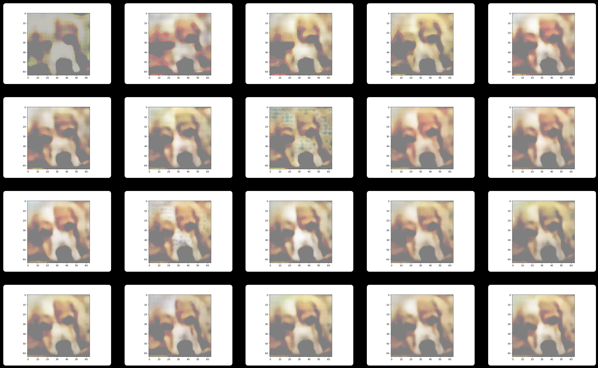
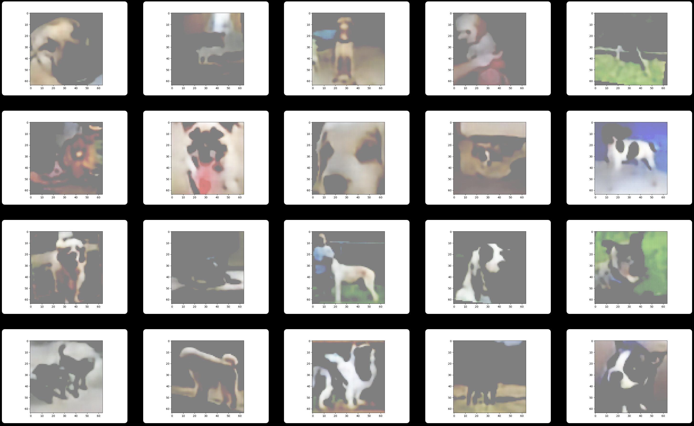
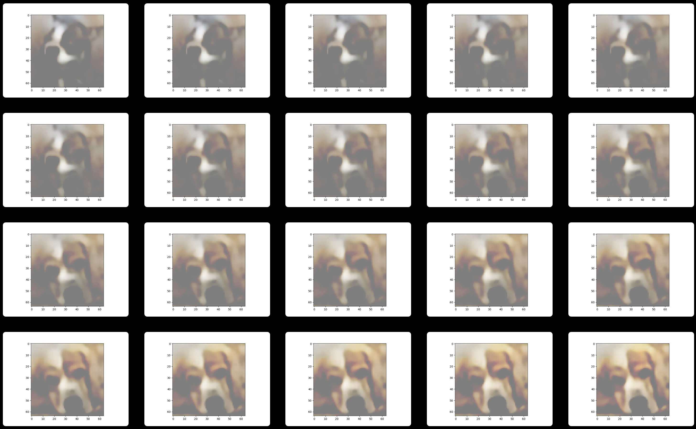

# A Variational Autoencoder Implementation

## Get started

This implementation is based on PyTorch. All code is in `main.py`, including both training and evaluation parts. To run the code, you need to first install required dependencies:

```shell
python3 -m pip install -r requirements.txt
```

And you also need to download the training images from [Stanford Dogs Dataset](http://vision.stanford.edu/aditya86/ImageNetDogs/), we didn't prepare the dataset in repository since it's too large (about 757MB). Put all the image files into `input/all-dogs` directory then the code will be able to access to it, the directory structure will be like:

```
.
├── LICENSE
├── README.md
├── input
│   └── all-dogs
│       ├── n02085620_199.jpg
│       ├── n02085620_242.jpg
│       ├── n02085620_7.jpg
│       └── ...
├── main.py
└── requirements.txt
```

Then you can run the code, all the output images will be saved in the `output` directory for the convenience for Linux Server developers as server side normally doesn't have GUI to display images.

```shell
python3 main.py
```

If you have at least one NVIDIA GPU on your machine and have installed CUDA, the program will be executed on GPU. It's **highly recommended** to use GPU since it will reduce the training time tremendously.

## Results demonstration

Reconstruct one image after each iteration of epoch:



The overall reconstruction results on multiple images:



Walk in the latent space from one dog to another:



## Reproducibility

We have tried many different random seeds and chosen a good one. The random seed has been set by `torch.manual_seed()` in `main.py` , the running results should be the same as the demonstrated images.
